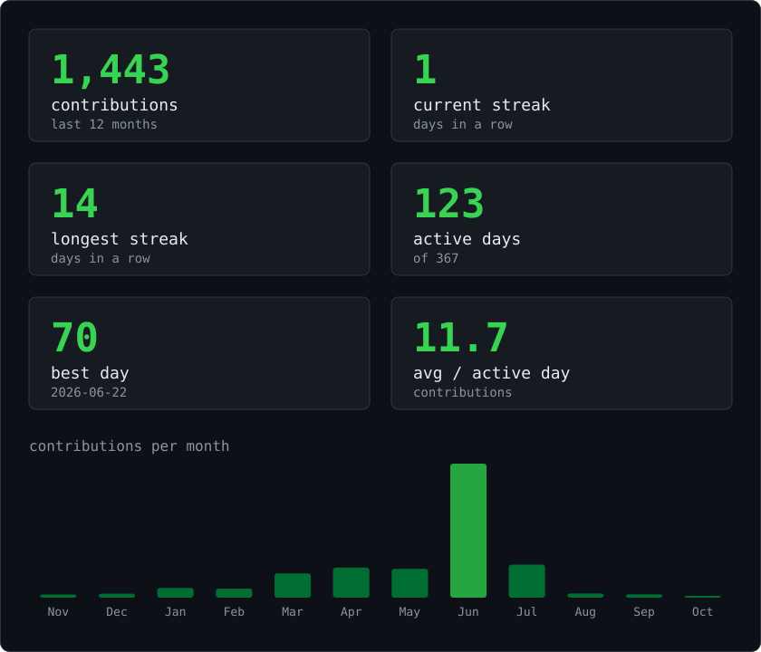

<!-- real data, regenerated daily by .github/workflows/update-profile.yml -->
<picture>
  <source media="(prefers-color-scheme: dark)" srcset="./assets/heatmap-dark.svg" />
  <source media="(prefers-color-scheme: light)" srcset="./assets/heatmap-light.svg" />
  
</picture>

 
 

<table>
<tr>
<td valign="top">
<picture>
  <source media="(prefers-color-scheme: dark)" srcset="./assets/ascii-dark.svg" />
  <source media="(prefers-color-scheme: light)" srcset="./assets/ascii-light.svg" />
  
</picture>
</td>
<td valign="top">
<picture>
  <source media="(prefers-color-scheme: dark)" srcset="./assets/stats-dark.svg" />
  <source media="(prefers-color-scheme: light)" srcset="./assets/stats-light.svg" />
  
</picture>
</td>
</tr>
</table>

<b>Dohyun Park · Cloud Engineer</b>

## About Me

- Computer and Information Engineering @ Kwangwoon University
- Interested in AWS Cloud Infrastructure & DevOps
- Hands-on experience with EKS, Terraform, and Argo CD

 
 
 

