<h3><code>dohyun@github ~ $ ./contributions.sh</code></h3>

<!-- real data, regenerated daily by .github/workflows/update-profile.yml -->

 
 

<h3><code>dohyun@github ~ $ whoami</code></h3>

<table>
<tr>
<td valign="top"></td>
<td valign="top"></td>
</tr>
</table>

<b>Dohyun Park · Cloud Engineer</b>

## About Me

- Computer and Information Engineering @ Kwangwoon University
- Interested in AWS Cloud Infrastructure & DevOps
- Hands-on experience with EKS, Terraform, and Argo CD

<h3><code>dohyun@github ~ $ ./links.sh</code></h3>

